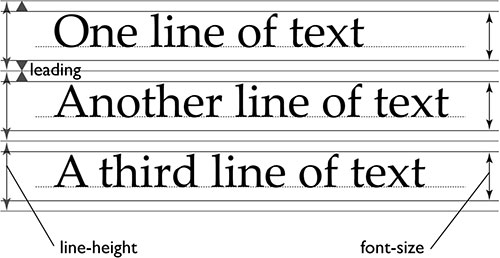

## 字体
从用户体验角度来讲，段落文本阅读体验最好的是黑体（无衬线体），而非宋体（衬线体），Win7的时候，字体默认的宋体，而从Windows 10开始，浏览器默认字体改成微软雅黑了，而 Mac OS 默认也是黑体而非宋体。

**推荐字体：**
1. Windows：MicroSoft YaHei（微软雅黑）
2. Mac OS：PingFang SC（苹方）或 Hiragino Sans GB（冬青黑体）

```
body{
     fomt-family: Hiragino Sans GB, MicroSoft YaHei;
}
```

_注：个人喜欢把苹方作为文章标题字体（20PX以上），而冬青黑体作为段落字体。_

## 字体颜色

**推荐字体颜色：#333**
```
body{
    color:#333;
}
```

## 字体大小

由于现在的电脑屏都是宽屏，手机的屏幕更是高清屏，所以字体大小建议采用**16px**字号会比较适合阅读。
```
body{
    font-size:16px;
}
```

## 字体行距



字体行距对于阅读也有有很大的影响，比较选中太小，对于多行文字的时候，容易在阅读时「串行」，所以字体的选中个人建议是字体的1.5 – 2.0倍之间。

**推荐行距：1.75EM**
```
body{
    line-height:1.75;
}
```

_这里后面我没有加入 em，是因为CSS默认就是 em 为单位，所以 em 可以省略不写_


## 最佳 CSS 写法

```
body {
  /*  字体  */
  font-family: -apple-system, BlinkMacSystemFont, 'Microsoft YaHei', sans-serif;

  /*  字号 */
  font-size: 16px;

  /*  字体颜色  */
  color: #333;

  /* 行距 */
  line-height: 1.75;
}
```
_**-apple-system** 和 **BlinkMacSystemFont** 就是让 MAC OS 自动选择系统字体的意思。_
